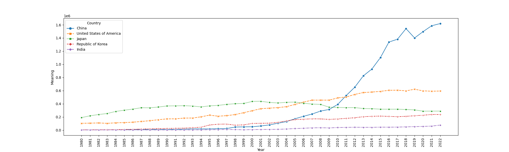
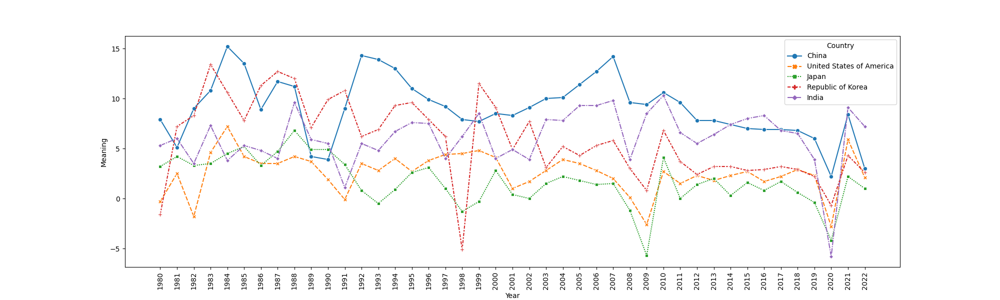
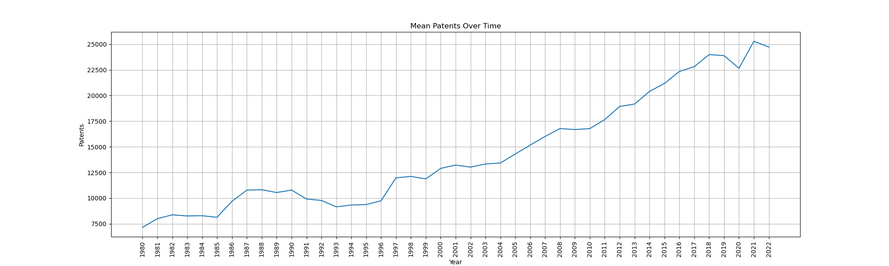
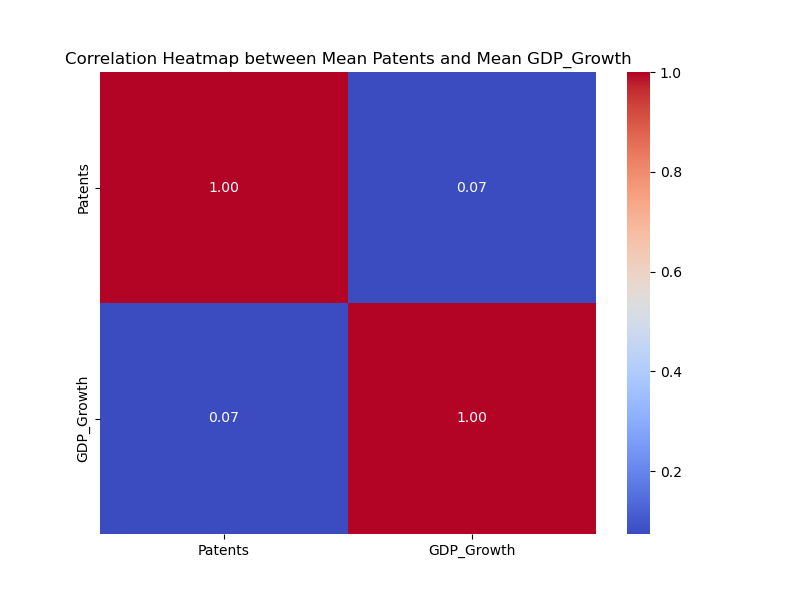
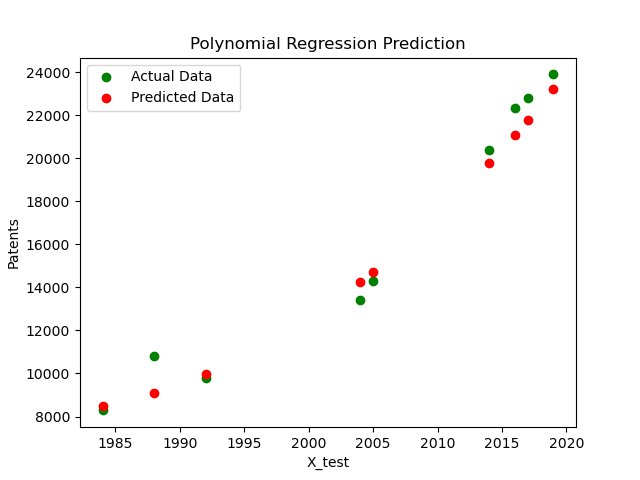

# <p align="center"><b>Patents-per-year-prediction</b></p>


## <p align="center"><b>Cleaned and Merged two data sets in the Data Frame</b></p>
#### First Data set was Patents per country. The second one was GDP rate growth

| Country             |   1980_patent |   1981_patent |   1982_patent |   1983_patent |   1984_patent |   1985_patent |   1986_patent |   1987_patent |   1988_patent |   1989_patent |   1990_patent |   1991_patent |   1992_patent |   1993_patent |   1994_patent |   1995_patent |   1996_patent |   1997_patent |   1998_patent |   1999_patent |   2000_patent |   2001_patent |   2002_patent |   2003_patent |   2004_patent |   2005_patent |   2006_patent |   2007_patent |   2008_patent |   2009_patent |   2010_patent |   2011_patent |   2012_patent |   2013_patent |   2014_patent |   2015_patent |   2016_patent |   2017_patent |   2018_patent |   2019_patent |   2020_patent |   2021_patent |   2022_patent |   1980_GDP |   1981_GDP |   1982_GDP |   1983_GDP |   1984_GDP |   1985_GDP |   1986_GDP |   1987_GDP |   1988_GDP |   1989_GDP |   1990_GDP |   1991_GDP |   1992_GDP |   1993_GDP |   1994_GDP |   1995_GDP |   1996_GDP |   1997_GDP |   1998_GDP |   1999_GDP |   2000_GDP |   2001_GDP |   2002_GDP |   2003_GDP |   2004_GDP |   2005_GDP |   2006_GDP |   2007_GDP |   2008_GDP |   2009_GDP |   2010_GDP |   2011_GDP |   2012_GDP |   2013_GDP |   2014_GDP |   2015_GDP |   2016_GDP |   2017_GDP |   2018_GDP |   2019_GDP |   2020_GDP |   2021_GDP |   2022_GDP |
|:--------------------|--------------:|--------------:|--------------:|--------------:|--------------:|--------------:|--------------:|--------------:|--------------:|--------------:|--------------:|--------------:|--------------:|--------------:|--------------:|--------------:|--------------:|--------------:|--------------:|--------------:|--------------:|--------------:|--------------:|--------------:|--------------:|--------------:|--------------:|--------------:|--------------:|--------------:|--------------:|--------------:|--------------:|--------------:|--------------:|--------------:|--------------:|--------------:|--------------:|--------------:|--------------:|--------------:|--------------:|-----------:|-----------:|-----------:|-----------:|-----------:|-----------:|-----------:|-----------:|-----------:|-----------:|-----------:|-----------:|-----------:|-----------:|-----------:|-----------:|-----------:|-----------:|-----------:|-----------:|-----------:|-----------:|-----------:|-----------:|-----------:|-----------:|-----------:|-----------:|-----------:|-----------:|-----------:|-----------:|-----------:|-----------:|-----------:|-----------:|-----------:|-----------:|-----------:|-----------:|-----------:|-----------:|-----------:|
| Albania             |           nan |           nan |           nan |           nan |           nan |           nan |           nan |           nan |           nan |           nan |           nan |           nan |           nan |            16 |             8 |             5 |             5 |             9 |            21 |            34 |            62 |           120 |           238 |           391 |           416 |           386 |           426 |           366 |           378 |           361 |           341 |            11 |           nan |             4 |            13 |            19 |            25 |            24 |            18 |             5 |            12 |            24 |            21 |        2.7 |      nan   |        2.9 |        1.1 |          2 |      nan   |        nan |      nan   |      nan   |        nan |        nan |      nan   |        nan |        nan |        nan |        nan |        nan |        nan |      nan   |      nan   |        nan |      nan   |        4.5 |        nan |        nan |        nan |      nan   |      nan   |      nan   |        3.4 |        3.7 |        2.5 |        1.4 |        1   |        1.8 |        2.2 |        3.3 |        3.8 |        4   |        2.1 |        nan |        nan |        4.8 |
| Algeria             |           354 |           354 |           334 |           308 |           375 |           258 |           235 |           180 |           206 |           204 |           235 |           176 |           174 |           146 |           145 |           162 |           200 |           241 |           309 |           284 |           159 |           145 |           334 |           326 |           392 |           524 |           669 |           849 |           nan |           nan |           806 |           897 |           900 |           840 |           813 |           805 |           672 |           743 |           673 |           638 |           710 |           849 |          1118 |      nan   |        3   |      nan   |      nan   |        nan |      nan   |        nan |      nan   |      nan   |        nan |        nan |      nan   |        nan |        nan |        nan |        nan |        nan |        nan |      nan   |        3.2 |        nan |        3   |      nan   |        nan |        nan |        nan |        1.7 |      nan   |        2.4 |      nan   |      nan   |        2.9 |      nan   |        2.8 |      nan   |      nan   |        3.2 |      nan   |      nan   |      nan   |        nan |        nan |        3.2 |
| Andorra             |           nan |           nan |           nan |           nan |           nan |           nan |           nan |           nan |           nan |           nan |           nan |           nan |           nan |           nan |           nan |           nan |           nan |           nan |           nan |           nan |           nan |           nan |           nan |           nan |           nan |           nan |           nan |           nan |           nan |           nan |           nan |           nan |           nan |           nan |           nan |           nan |             3 |             6 |            11 |            15 |             8 |            11 |             8 |      nan   |      nan   |      nan   |      nan   |        nan |      nan   |        nan |      nan   |      nan   |        nan |        nan |      nan   |        nan |        nan |        nan |        nan |        nan |        nan |      nan   |      nan   |        nan |      nan   |      nan   |        nan |        nan |        nan |      nan   |        1.6 |      nan   |      nan   |      nan   |      nan   |      nan   |      nan   |        2.5 |        1.4 |      nan   |        0.3 |        1.6 |        2   |        nan |        nan |      nan   |
| Angola              |           nan |           nan |           nan |           nan |           nan |           nan |           nan |           nan |           nan |           nan |           nan |           nan |             6 |           nan |           nan |           nan |           nan |           nan |           nan |           nan |           nan |           nan |           nan |           nan |           nan |           nan |           nan |           nan |           nan |           nan |           nan |           nan |           nan |           nan |           nan |           nan |           nan |           nan |           120 |           110 |            85 |            86 |            80 |      nan   |      nan   |      nan   |        4.2 |          6 |        3.5 |        nan |        4.1 |        6.1 |        nan |        nan |      nan   |        nan |        nan |        nan |        nan |        nan |        nan |        4.7 |      nan   |        nan |        4.2 |      nan   |        nan |        nan |        nan |      nan   |      nan   |      nan   |      nan   |        4.9 |        3.5 |      nan   |        5   |        4.8 |      nan   |      nan   |      nan   |      nan   |      nan   |        nan |        nan |      nan   |
| Antigua and Barbuda |           nan |           nan |           nan |           nan |           nan |           nan |           nan |           nan |           nan |           nan |           nan |           nan |           nan |           nan |           nan |           nan |           nan |           nan |           nan |           nan |           nan |           nan |           nan |           nan |           nan |           nan |           nan |           nan |           nan |           nan |           nan |             8 |             7 |             7 |            15 |            10 |            12 |             8 |            10 |           nan |             3 |             8 |             6 |      nan   |        3.8 |      nan   |      nan   |        nan |      nan   |        nan |      nan   |      nan   |        nan |          3 |        2.2 |        nan |        nan |        nan |        nan |        nan |        nan |        4.7 |        3.7 |        nan |      nan   |      nan   |        nan |        nan |        nan |      nan   |      nan   |      nan   |      nan   |      nan   |      nan   |        3.4 |      nan   |        3.8 |        3.8 |      nan   |        3.1 |      nan   |        4.3 |        nan |        nan |      nan   |

## Generated line plot for TOP 5 patent holder countries


## Line plot GDP Rate for TOP 5 patent holders


## Exprolatory Data Anlisys
#### After cleaning data and making sure that NaN will not influence our model.
#### We Build lineplot Mean Patents Over Years through all countries

#### Checked the correlation between Patents made and GDP Growth Rate
#### The meanings is poor correlated as expected


## Building Linear Regression Model
#### Tested model with Year and Patents data
#### The R-squared value is 0.918, indicating that approximately 91.8% of the variance in 'Patents' is explained by the 'Year' variable. The adjusted R-squared, which accounts for the number of predictors, is also high at 0.916.
#### The F-statistic is 458.5, and the associated p-value is close to zero (7.13e-24). This suggests that the model is statistically significant as a whole.
```
                            OLS Regression Results                            
==============================================================================
Dep. Variable:                Patents   R-squared:                       0.918
Model:                            OLS   Adj. R-squared:                  0.916
Method:                 Least Squares   F-statistic:                     458.5
Date:                Tue, 12 Dec 2023   Prob (F-statistic):           7.13e-24
Time:                        14:27:05   Log-Likelihood:                -376.78
No. Observations:                  43   AIC:                             757.6
Df Residuals:                      41   BIC:                             761.1
Df Model:                           1                                         
Covariance Type:            nonrobust                                         
==============================================================================
                 coef    std err          t      P>|t|      [0.025      0.975]
------------------------------------------------------------------------------
const      -8.192e+05   3.89e+04    -21.042      0.000   -8.98e+05   -7.41e+05
x1           416.5945     19.456     21.412      0.000     377.302     455.887
==============================================================================
Omnibus:                       17.457   Durbin-Watson:                   0.236
Prob(Omnibus):                  0.000   Jarque-Bera (JB):                3.324
Skew:                           0.036   Prob(JB):                        0.190
Kurtosis:                       1.640   Cond. No.                     3.23e+05
==============================================================================

Notes:
[1] Standard Errors assume that the covariance matrix of the errors is correctly specified.
[2] The condition number is large, 3.23e+05. This might indicate that there are
strong multicollinearity or other numerical problems.
```
#### Decided that better chose will be Polynomial Model
#### After test/split training got such results

## Model implemenatation
#### Asked model to build prediction of Patents growth in future years
